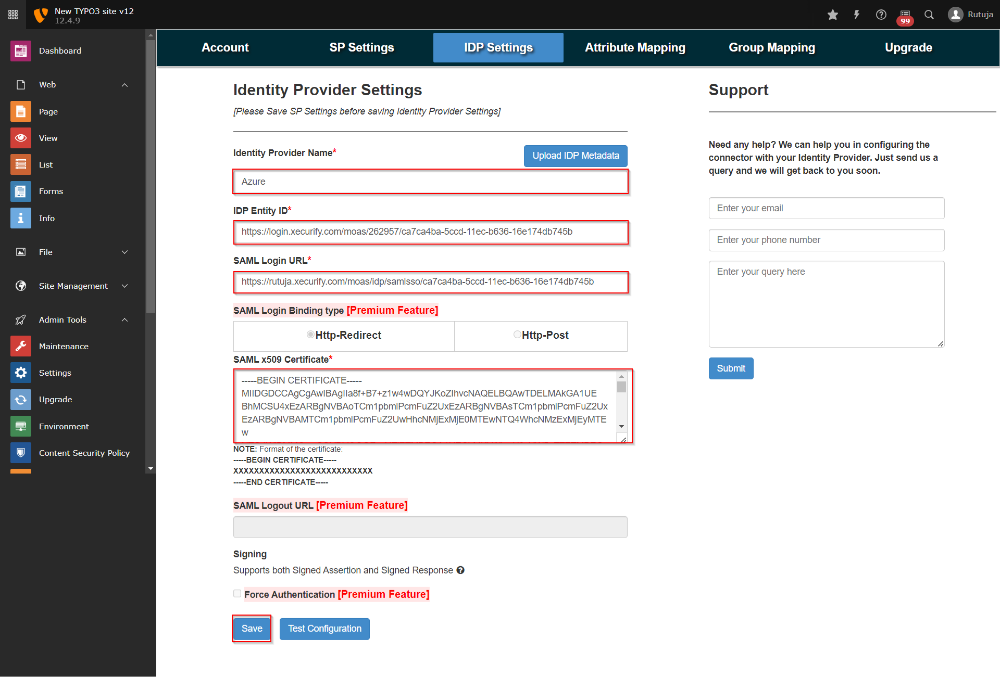

IDP-Configurations
==================

Identity Provider Metadata Configurations (Using XML Metadata)
--------------------------------------------------------------

* Either download the IDP Metadata file or copy the IDP Metadata URL from your Identity Provider
* Navigate to the IDP Settings tab of the plugin and click on Upload IDP Metadata button
* Add the name of your Identity Provider.
* add the downloaded IDP Metadata file or paste the IDP Metadata URL copied from your Identity Provider and save it.

* Once you save the settings all the Metadata details will be fetched automatically.

OR

Identity Provider Metadata Configurations (Manually)
----------------------------------------------------

* Identity Provider Name: {Add your Identity Provider Name}
* IDP Entity ID: {Add your Identity Provider Entity ID}
* SAML Login URL: {Add your Identity Provider Single Sign On Service URL}
* SAML x509 Certificate: {Add your Identity Provider x509 certificate}

* Once you configure both Identity Provider and Service Provider Metadata, click the Test Configuration button to check if the configurations are made correctly.

Default Group Mapping
---------------------

* Navigate to the Group Mapping tab of the plugin, select the default group to be assigned to the new users in Typo3 and save the settings.

* Once you have done all the above steps, you are ready to test the SSO. You can use your Fesaml Page URL in order to initiate the SSO.

* If you are looking for anything which you cannot find, please drop us an email on info@xecurify.com