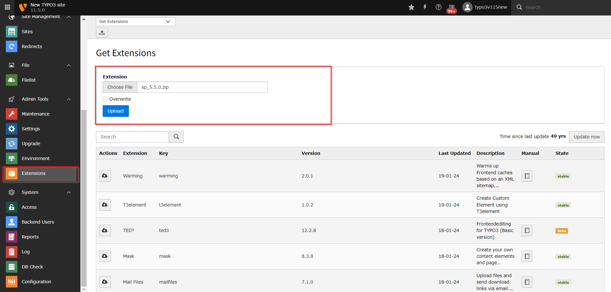

Installation
============

Extension Installation
**********************

Using composer:
---------------------

Use the below command to install the extension using composer:

.. code-block:: bash

   composer req miniorange/miniorange-saml
   
OR 

Using zip file:
---------------------

* Download the zip file of the miniOrange SAML SSO extension from TYPO3 marketplace.
* Rename the zip file from miniorange_saml.zip to sp.zip
* Go to your TYPO3 backend and click on Extensions section at the left side of your screen.
* Upload the zip file as represented in the below image.

