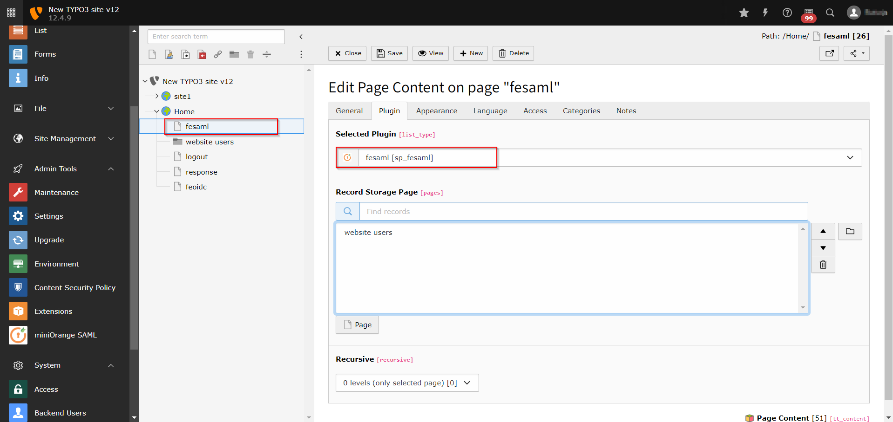
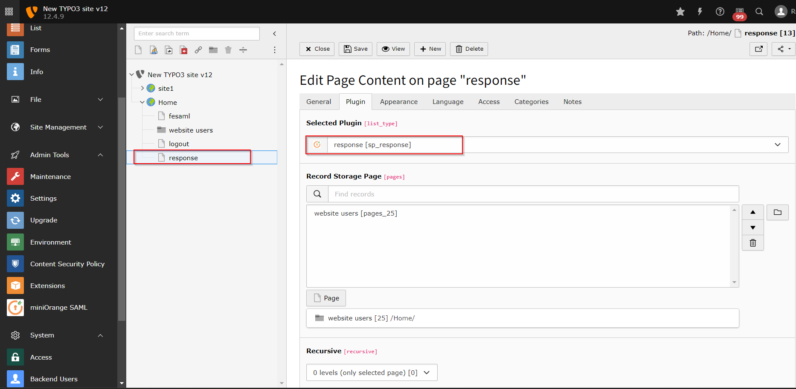
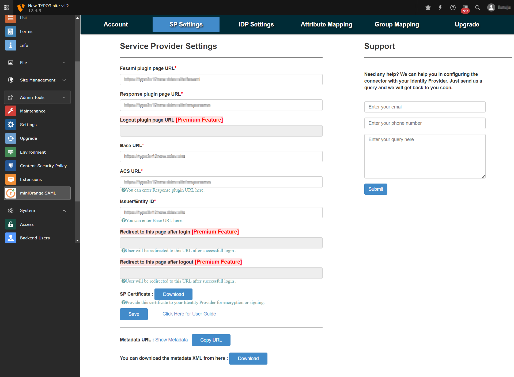

SP-Configurations
=================

Pre-requirements Before Configuring SP-Configurations
*********************************************

You must have atleast two pages before configuring the extension.

.. tip:: Pages can be created by the following steps:-

* Navigate to the Pages section and create new standard page with name fesaml and add fesaml plugin to it.
* Similarly create a page named response and and response plugin to it.
* You can refer to the below screenshots for the same.

* Create SSO Login button in your Typo3 Frontend Site and embed the fesaml page URL to it in order to initiate the SSO.

Service Provider Metadata Configurations
****************************************

* Once the extension is installed successfully, navigate to the SP settings tab and configure the fields as below:
	- Fesaml plugin page URL: {URL of the Fesaml standard page created in earlier steps}
	- Response plugin page URL: {URL of the Response standard page created in earlier steps}
	- Base URL: {Base URL of your Typo3 site}
	- ACS URL: {URL of the Response standard page created in earlier steps}
	- Issuer/Entity ID: {Base URL of your Typo3 site}

* Once you save the above details, you can download the SP XML Metadata or you can use XML Metadata URL to upload it in your Identity Provider or you can upload it manually.

* You can choose the setup guide specific to your Identity Provider from below link:
https://plugins.miniorange.com/typo3-saml-sso-setup-guides